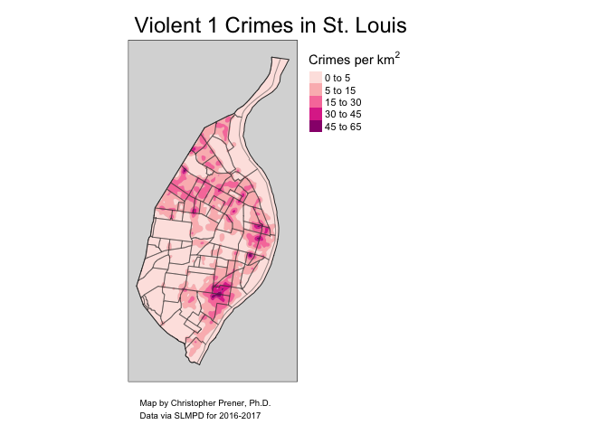

Density Map - Violent Crimes
================
Christopher Prener, Ph.D.
(January 15, 2019)

## Introduction

This notebook contains the code for creating density maps of violent
crimes in St. Louis.

## Dependencies

This notebook requires:

``` r
# tidyverse packages
library(dplyr)         # data wrangling
```

    ## 
    ## Attaching package: 'dplyr'

    ## The following objects are masked from 'package:stats':
    ## 
    ##     filter, lag

    ## The following objects are masked from 'package:base':
    ## 
    ##     intersect, setdiff, setequal, union

``` r
library(readr)         # working with csv data

# spatial packages
library(sf)            # working with spatial data
```

    ## Linking to GEOS 3.6.1, GDAL 2.1.3, PROJ 4.9.3

``` r
library(tigris)        # tiger/line api access        
```

    ## To enable 
    ## caching of data, set `options(tigris_use_cache = TRUE)` in your R script or .Rprofile.

    ## 
    ## Attaching package: 'tigris'

    ## The following object is masked from 'package:graphics':
    ## 
    ##     plot

``` r
library(tmap)          # mapping
library(tmaptools)     # mapping

# other packages
library(here)          # file path management
```

    ## here() starts at /Users/chris/GitHub/Personal/STL_CRIME_Belmar

## Load Data

We’ll load both the crime data and the neighborhood boundaries for
mapping:

``` r
read_csv(here("data", "clean", "v_crimes.csv")) %>%
  st_as_sf(coords = c("XCoord", "YCoord"), crs = 102696) -> crimes
```

    ## Parsed with column specification:
    ## cols(
    ##   Complaint = col_character(),
    ##   DateOccur = col_character(),
    ##   Crime = col_double(),
    ##   crimeCat = col_character(),
    ##   Description = col_character(),
    ##   ILEADSAddress = col_double(),
    ##   ILEADSStreet = col_character(),
    ##   XCoord = col_double(),
    ##   YCoord = col_double(),
    ##   xyStatus = col_logical()
    ## )

``` r
st_read(here("data", "clean", "STL_CRIME_Neighborhoods", "STL_CRIME_Neighborhoods.shp")) %>%
  st_transform(crs = 102696) -> nhoods
```

    ## Reading layer `STL_CRIME_Neighborhoods' from data source `/Users/chris/GitHub/Personal/STL_CRIME_Belmar/data/clean/STL_CRIME_Neighborhoods/STL_CRIME_Neighborhoods.shp' using driver `ESRI Shapefile'
    ## Simple feature collection with 88 features and 7 fields
    ## geometry type:  MULTIPOLYGON
    ## dimension:      XY
    ## bbox:           xmin: 871512.3 ymin: 982994.4 xmax: 912850.5 ymax: 1070957
    ## epsg (SRID):    NA
    ## proj4string:    +proj=tmerc +lat_0=35.83333333333334 +lon_0=-90.5 +k=0.9999333333333333 +x_0=250000 +y_0=0 +datum=NAD83 +units=us-ft +no_defs

## Download Data

Next, we need to get St. Louis’s boundary for both mapping and some
final data cleaning:

``` r
counties(state = 29, class = "sf") %>%
  select(COUNTYFP) %>%
  filter(COUNTYFP == 510) %>%
  st_transform(crs = 102696) -> stLouis
```

    ## 
      |                                                                       
      |                                                                 |   0%
      |                                                                       
      |                                                                 |   1%
      |                                                                       
      |=                                                                |   1%
      |                                                                       
      |=                                                                |   2%
      |                                                                       
      |==                                                               |   2%
      |                                                                       
      |==                                                               |   3%
      |                                                                       
      |==                                                               |   4%
      |                                                                       
      |===                                                              |   4%
      |                                                                       
      |===                                                              |   5%
      |                                                                       
      |====                                                             |   5%
      |                                                                       
      |====                                                             |   6%
      |                                                                       
      |====                                                             |   7%
      |                                                                       
      |=====                                                            |   7%
      |                                                                       
      |=====                                                            |   8%
      |                                                                       
      |======                                                           |   8%
      |                                                                       
      |======                                                           |   9%
      |                                                                       
      |======                                                           |  10%
      |                                                                       
      |=======                                                          |  10%
      |                                                                       
      |=======                                                          |  11%
      |                                                                       
      |=======                                                          |  12%
      |                                                                       
      |========                                                         |  12%
      |                                                                       
      |========                                                         |  13%
      |                                                                       
      |=========                                                        |  13%
      |                                                                       
      |=========                                                        |  14%
      |                                                                       
      |=========                                                        |  15%
      |                                                                       
      |==========                                                       |  15%
      |                                                                       
      |==========                                                       |  16%
      |                                                                       
      |===========                                                      |  16%
      |                                                                       
      |===========                                                      |  17%
      |                                                                       
      |===========                                                      |  18%
      |                                                                       
      |============                                                     |  18%
      |                                                                       
      |============                                                     |  19%
      |                                                                       
      |=============                                                    |  19%
      |                                                                       
      |=============                                                    |  20%
      |                                                                       
      |=============                                                    |  21%
      |                                                                       
      |==============                                                   |  21%
      |                                                                       
      |==============                                                   |  22%
      |                                                                       
      |===============                                                  |  22%
      |                                                                       
      |===============                                                  |  23%
      |                                                                       
      |===============                                                  |  24%
      |                                                                       
      |================                                                 |  24%
      |                                                                       
      |================                                                 |  25%
      |                                                                       
      |=================                                                |  25%
      |                                                                       
      |=================                                                |  26%
      |                                                                       
      |=================                                                |  27%
      |                                                                       
      |==================                                               |  27%
      |                                                                       
      |==================                                               |  28%
      |                                                                       
      |===================                                              |  28%
      |                                                                       
      |===================                                              |  29%
      |                                                                       
      |===================                                              |  30%
      |                                                                       
      |====================                                             |  30%
      |                                                                       
      |====================                                             |  31%
      |                                                                       
      |====================                                             |  32%
      |                                                                       
      |=====================                                            |  32%
      |                                                                       
      |=====================                                            |  33%
      |                                                                       
      |======================                                           |  33%
      |                                                                       
      |======================                                           |  34%
      |                                                                       
      |======================                                           |  35%
      |                                                                       
      |=======================                                          |  35%
      |                                                                       
      |=======================                                          |  36%
      |                                                                       
      |========================                                         |  36%
      |                                                                       
      |========================                                         |  37%
      |                                                                       
      |========================                                         |  38%
      |                                                                       
      |=========================                                        |  38%
      |                                                                       
      |=========================                                        |  39%
      |                                                                       
      |==========================                                       |  39%
      |                                                                       
      |==========================                                       |  40%
      |                                                                       
      |==========================                                       |  41%
      |                                                                       
      |===========================                                      |  41%
      |                                                                       
      |===========================                                      |  42%
      |                                                                       
      |============================                                     |  42%
      |                                                                       
      |============================                                     |  43%
      |                                                                       
      |============================                                     |  44%
      |                                                                       
      |=============================                                    |  44%
      |                                                                       
      |=============================                                    |  45%
      |                                                                       
      |==============================                                   |  45%
      |                                                                       
      |==============================                                   |  46%
      |                                                                       
      |==============================                                   |  47%
      |                                                                       
      |===============================                                  |  47%
      |                                                                       
      |===============================                                  |  48%
      |                                                                       
      |================================                                 |  48%
      |                                                                       
      |================================                                 |  49%
      |                                                                       
      |================================                                 |  50%
      |                                                                       
      |=================================                                |  50%
      |                                                                       
      |=================================                                |  51%
      |                                                                       
      |=================================                                |  52%
      |                                                                       
      |==================================                               |  52%
      |                                                                       
      |==================================                               |  53%
      |                                                                       
      |===================================                              |  53%
      |                                                                       
      |===================================                              |  54%
      |                                                                       
      |===================================                              |  55%
      |                                                                       
      |====================================                             |  55%
      |                                                                       
      |====================================                             |  56%
      |                                                                       
      |=====================================                            |  56%
      |                                                                       
      |=====================================                            |  57%
      |                                                                       
      |=====================================                            |  58%
      |                                                                       
      |======================================                           |  58%
      |                                                                       
      |======================================                           |  59%
      |                                                                       
      |=======================================                          |  59%
      |                                                                       
      |=======================================                          |  60%
      |                                                                       
      |=======================================                          |  61%
      |                                                                       
      |========================================                         |  61%
      |                                                                       
      |========================================                         |  62%
      |                                                                       
      |=========================================                        |  62%
      |                                                                       
      |=========================================                        |  63%
      |                                                                       
      |=========================================                        |  64%
      |                                                                       
      |==========================================                       |  64%
      |                                                                       
      |==========================================                       |  65%
      |                                                                       
      |===========================================                      |  65%
      |                                                                       
      |===========================================                      |  66%
      |                                                                       
      |===========================================                      |  67%
      |                                                                       
      |============================================                     |  67%
      |                                                                       
      |============================================                     |  68%
      |                                                                       
      |=============================================                    |  68%
      |                                                                       
      |=============================================                    |  69%
      |                                                                       
      |=============================================                    |  70%
      |                                                                       
      |==============================================                   |  70%
      |                                                                       
      |==============================================                   |  71%
      |                                                                       
      |==============================================                   |  72%
      |                                                                       
      |===============================================                  |  72%
      |                                                                       
      |===============================================                  |  73%
      |                                                                       
      |================================================                 |  73%
      |                                                                       
      |================================================                 |  74%
      |                                                                       
      |================================================                 |  75%
      |                                                                       
      |=================================================                |  75%
      |                                                                       
      |=================================================                |  76%
      |                                                                       
      |==================================================               |  76%
      |                                                                       
      |==================================================               |  77%
      |                                                                       
      |==================================================               |  78%
      |                                                                       
      |===================================================              |  78%
      |                                                                       
      |===================================================              |  79%
      |                                                                       
      |====================================================             |  79%
      |                                                                       
      |====================================================             |  80%
      |                                                                       
      |====================================================             |  81%
      |                                                                       
      |=====================================================            |  81%
      |                                                                       
      |=====================================================            |  82%
      |                                                                       
      |======================================================           |  82%
      |                                                                       
      |======================================================           |  83%
      |                                                                       
      |======================================================           |  84%
      |                                                                       
      |=======================================================          |  84%
      |                                                                       
      |=======================================================          |  85%
      |                                                                       
      |========================================================         |  85%
      |                                                                       
      |========================================================         |  86%
      |                                                                       
      |========================================================         |  87%
      |                                                                       
      |=========================================================        |  87%
      |                                                                       
      |=========================================================        |  88%
      |                                                                       
      |==========================================================       |  88%
      |                                                                       
      |==========================================================       |  89%
      |                                                                       
      |==========================================================       |  90%
      |                                                                       
      |===========================================================      |  90%
      |                                                                       
      |===========================================================      |  91%
      |                                                                       
      |===========================================================      |  92%
      |                                                                       
      |============================================================     |  92%
      |                                                                       
      |============================================================     |  93%
      |                                                                       
      |=============================================================    |  93%
      |                                                                       
      |=============================================================    |  94%
      |                                                                       
      |=============================================================    |  95%
      |                                                                       
      |==============================================================   |  95%
      |                                                                       
      |==============================================================   |  96%
      |                                                                       
      |===============================================================  |  96%
      |                                                                       
      |===============================================================  |  97%
      |                                                                       
      |===============================================================  |  98%
      |                                                                       
      |================================================================ |  98%
      |                                                                       
      |================================================================ |  99%
      |                                                                       
      |=================================================================|  99%
      |                                                                       
      |=================================================================| 100%

## Removing Crimes Outside of St. Louis

We don’t want to map crimes that happen in the county or elsewhere, so
we’ll complete a spatial join and remove crimes that do not fall within
the city:

``` r
st_intersection(crimes, stLouis) %>%
  select(-xyStatus, -COUNTYFP) -> crimes_stl
```

    ## Warning: attribute variables are assumed to be spatially constant
    ## throughout all geometries

## Density Map

To create a density map, we need to specify breaks for our values:

``` r
crime_densities <- smooth_map(crimes_stl, bandwidth = 0.5, 
  breaks = c(0, 5, 15, 30, 45, 65), cover = stLouis)
```

    ## 
      |                                                                       
      |                                                                 |   0%
      |                                                                       
      |======                                                           |  10%
      |                                                                       
      |====================                                             |  30%
      |                                                                       
      |================================                                 |  50%
      |                                                                       
      |==============================================                   |  70%
      |                                                                       
      |==========================================================       |  90%
      |                                                                       
      |=================================================================| 100%

We can then create our map:

``` r
tm_shape(crime_densities$polygons) +
  tm_fill(col = "level", palette = "RdPu", 
    title = expression("Crimes per " * km^2)) + 
  tm_shape(stLouis) + 
  tm_borders() +
  tm_shape(nhoods) + 
  tm_borders(col = "grey25", alpha = .5) +
  tm_style("gray") +
  tm_credits("Map by Christopher Prener, Ph.D. \nData via SLMPD for 2016-2017", position = c("left", "BOTTOM")) +
  tm_layout(
    main.title = "Violent Crimes in St. Louis",
        main.title.position = "left",
        attr.outside = TRUE, 
        legend.outside = TRUE,
        inner.margins = c(.05, .05, .05, .05)
        ) -> densityMap

densityMap
```

<!-- -->

## Write Map

We’ll save the map for publication:

``` r
tmap_save(densityMap, filename = here("results", "density_map_v.png"), 
          dpi = 500)
```

    ## Map saved to /Users/chris/GitHub/Personal/STL_CRIME_Belmar/results/density_map_v.png

    ## Resolution: 3500 by 2500 pixels

    ## Size: 7 by 5 inches (500 dpi)
