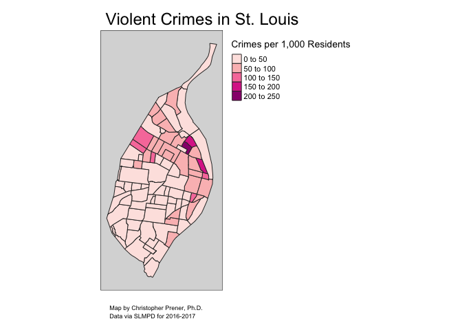

Choropleth Map - Part 1 Crimes
================
Christopher Prener, Ph.D.
(January 15, 2019)

## Introduction

This notebook contains the code for creating a normalized choropleth map
in St. Louis.

## Dependencies

This notebook requires:

``` r
# spatial packages
library(sf)            # working with spatial data
```

    ## Linking to GEOS 3.6.1, GDAL 2.1.3, PROJ 4.9.3

``` r
library(tigris)        # tiger/line api access        
```

    ## To enable 
    ## caching of data, set `options(tigris_use_cache = TRUE)` in your R script or .Rprofile.

    ## 
    ## Attaching package: 'tigris'

    ## The following object is masked from 'package:graphics':
    ## 
    ##     plot

``` r
library(tmap)          # mapping
library(tmaptools)     # mapping

# other packages
library(here)          # file path management
```

    ## here() starts at /Users/chris/GitHub/Personal/STL_CRIME_Belmar

## Load Data

We’ll load the neighborhood boundaries for
plotting:

``` r
st_read(here("data", "clean", "STL_CRIME_Neighborhoods", "STL_CRIME_Neighborhoods.shp")) %>%
  st_transform(crs = 102696) -> nhoods
```

    ## Reading layer `STL_CRIME_Neighborhoods' from data source `/Users/chris/GitHub/Personal/STL_CRIME_Belmar/data/clean/STL_CRIME_Neighborhoods/STL_CRIME_Neighborhoods.shp' using driver `ESRI Shapefile'
    ## Simple feature collection with 88 features and 7 fields
    ## geometry type:  MULTIPOLYGON
    ## dimension:      XY
    ## bbox:           xmin: 871512.3 ymin: 982994.4 xmax: 912850.5 ymax: 1070957
    ## epsg (SRID):    NA
    ## proj4string:    +proj=tmerc +lat_0=35.83333333333334 +lon_0=-90.5 +k=0.9999333333333333 +x_0=250000 +y_0=0 +datum=NAD83 +units=us-ft +no_defs

## Create Map

Next, we’ll create our map:

``` r
tm_shape(nhoods) +
  tm_polygons(col = "vRate",
              palette = "RdPu",
              title = expression("Crimes per 1,000 Residents")) +
  tm_credits("Map by Christopher Prener, Ph.D. \nData via SLMPD for 2016-2017", position = c("left", "BOTTOM")) +
  tm_style("gray") +
  tm_layout(
    main.title = "Violent Crimes in St. Louis",
        main.title.position = "left",
        attr.outside = TRUE, 
        legend.outside = TRUE,
        inner.margins = c(.05, .05, .05, .05)
        )  -> rateMap

rateMap
```

<!-- -->

## Write Map

We’ll save the map for publication:

``` r
tmap_save(rateMap, filename = here("results", "rate_map_v.png"), 
          dpi = 500)
```

    ## Map saved to /Users/chris/GitHub/Personal/STL_CRIME_Belmar/results/rate_map_v.png

    ## Resolution: 3500 by 2500 pixels

    ## Size: 7 by 5 inches (500 dpi)
